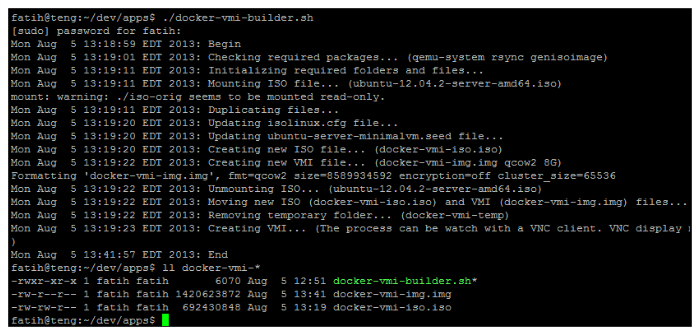
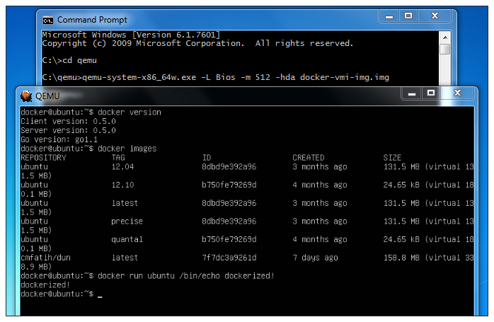

## Docker VMI Builder

  [docker-vmi-builder](http://github.com/cmfatih/docker-vmi-builder) is a [Docker](http://www.docker.io/) virtual machine image builder for Ubuntu. 
  The VMI file can be used with any virtual machine which has support for x86_64 / amd64 system and qcow2 disk image format.
  
### Installation

```
git clone https://github.com/cmfatih/docker-vmi-builder.git
```

### Usage

```
./docker-vmi-builder.sh
```

### Test

```
sudo qemu-system-x86_64 -enable-kvm -m 512 -hda docker-vmi-img.img -display none -usbdevice tablet -vnc :5,docker -net user,hostfwd=tcp:127.0.0.1:8022-:22 -net nic -daemonize
ssh docker@localhost -p 8022
```

### Requirements

```
Ubuntu Packages
  qemu-system 
  rsync 
  genisoimage
```

### Notes

* For login; username: ``docker`` , password: ``docker``
* The building process requires *sudo* for mounting Ubuntu ISO file and running QEMU with KVM capability. KVM is not required but it affects to the performance.
* *ubuntu-12.04.2-server-amd64.iso* file (656MB) will be downloaded from Ubuntu server. Putting this file to the script folder (before running the builder) will prevent download process.
* The process will create ~1.35GB **uncompressed** qcow2 formatted image file. It can be **compress** to ~400MB.
* The building process can be monitor with VNC client.
* Qemu doesn't require X Window System. Use ``-display none -net user,hostfwd=tcp:127.0.0.1:8022-:22 -net nic`` parameter for starting VM and use ``ssh docker@localhost -p 8022`` for connection.
* [Qemu for Windows](http://lassauge.free.fr/qemu/) doesn't require any installation. So [Qemu archive file](http://lassauge.free.fr/qemu/release/Qemu-1.5.1-windows.zip) and the VMI can be contribute with a single archive file.

### Showcase

**The building process**



**Using the VMI on Windows with Qemu**



**Using the VMI on Windows with Qemu+SSH+PuTTY**


### License

Copyright (c) 2013 Fatih Cetinkaya (http://github.com/cmfatih/docker-vmi-builder)  
Licensed under The MIT License (MIT)  
For the full copyright and license information, please view the LICENSE.txt file.
